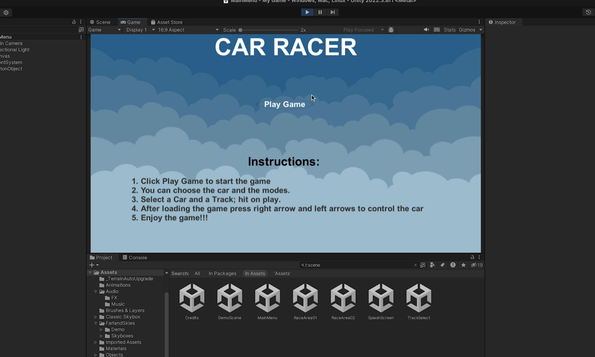
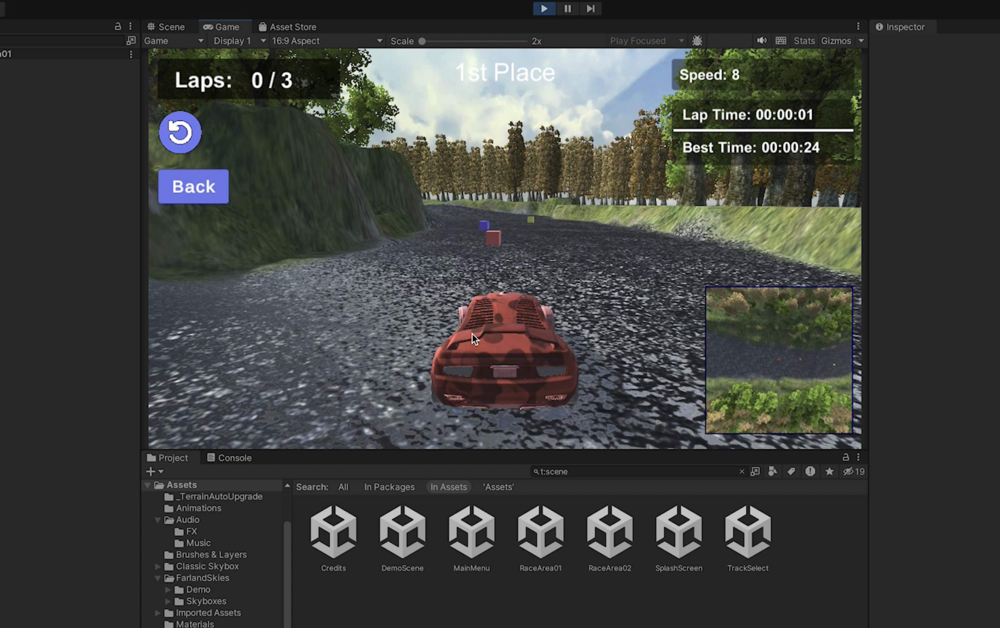
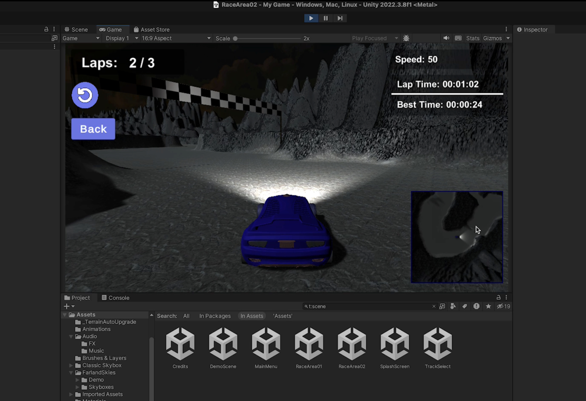
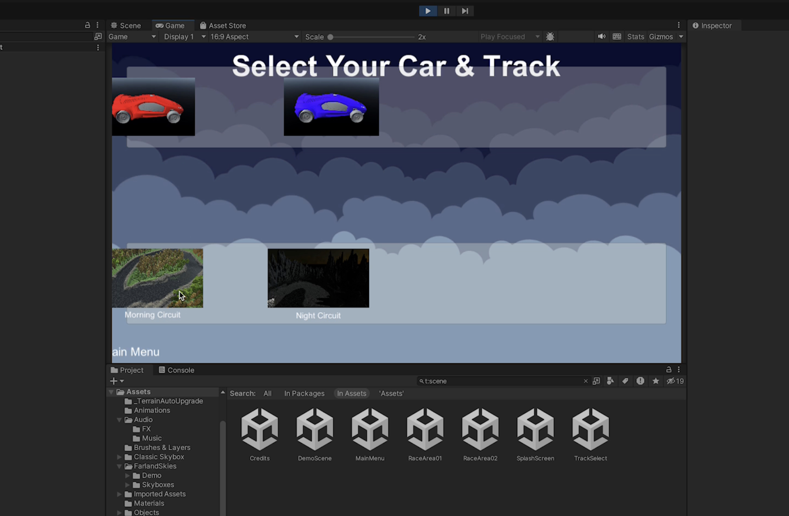

Game Recording: https://drive.google.com/file/d/1L37QaGK-9qWGRC3ippxSB0jzMatnk4hT/view?usp=sharing

# Final Racing Game Documentation

## Overview
This documentation details the Car Racing Game developed as part of our major class project. Set against varied environments, including mountainous terrains: this game offers multiple circuits and car configurations, providing an immersive racing experience.

## Game Features

### Environment and Circuits
- **Terrain**: The racing circuits are located in environments that include mountainous areas. 
- **Circuit Variety**: Players can choose one from two different circuits, each offering unique challenges and layouts.

### Vehicles and Customization
- **Car Selection**: Two car models are available, each with distinct models and color configurationss
- **Customization**: Players can select their preferred car and environment for different racing conditions.

### Game Interface
- **Menu System**: A user-friendly menu allows players to select circuits and cars. Options for different times of day, such as morning or night, are also available.
- **HUD**: During races, the HUD displays crucial information such as current speed, lap number, and other relevant details.

### Controls and Gameplay
- **Controls**: The game can be controlled using WSAD keys or arrow keys.
- **Laps**: Each race consists of 3 laps, with the race concluding after the third lap.
- **Restart and Navigation**: Players can restart the game or return to the home screen to select different cars or circuits via in-game icons.

### Sound and Visual Effects
- **Audio**: The game includes various sound effects like accelrating, turning reverse and background music to enhance the racing experience.
- **Visual FX**: Dynamic visual effects are used to enrich the gameplay, especially during different times of the day.

### Additional Features
- **Mini Map**: A mini-map on the left of the screen shows upcoming turns, aiding in navigation.

## Gallery: Gameplay Screenshots (Home, Morning Circuit, Night Circuit & Selecting Different Modes). 

## Player Instructions

1. **Starting the Game**:
   - Click 'Play Game' to enter the main menu.
2. **Selecting Car and Circuit**:
   - Choose a car model and the desired environment (morning or night).
   - After selection, hit 'Play' to start the race.
3. **During the Race**:
   - Use WSAD or arrow keys to control the car.
   - Monitor your progress and car stats on the HUD.
   - Navigate using the mini-map to anticipate turns.
4. **Restarting or Changing Options**:
   - Click the restart icon on the top left to restart the race.
   - Use the 'Back' button to return to the main menu for new selections.

## Further Improvments: 

1) Integrate a dynamic weather system that affects race conditions and vehicle handling. For instance, rain could make tracks slippery, reducing grip and requiring players to adapt their driving style. Foggy conditions could reduce visibility, adding an element of unpredictability and challenge. Weather changes could be random or specific to certain tracks, enhancing the realism and variability of each race.

2) Implement a detailed vehicle damage model where collisions and accidents have a realistic impact on the car's performance. For example, damage to the front of the car could affect steering, while engine damage might reduce top speed. Include pit stops in longer races where players can choose to repair damage, refuel, or change tires, adding strategic decisions to the racing experience.

3) Add tracks with interactive elements, such as movable barriers, shortcuts that open and close dynamically, or sections of the track that change layout mid-race. This would keep players on their toes and require them to constantly adapt to new racing conditions. Additionally, creating tracks that have multiple paths or hidden shortcuts can encourage exploration and replayability.

## Conclusion

This Car Racing Game combines strategic elements of racing with diverse environmental settings and dynamic gameplay. It is designed to offer a comprehensive racing experience that tests both driving skills and strategic planning.

